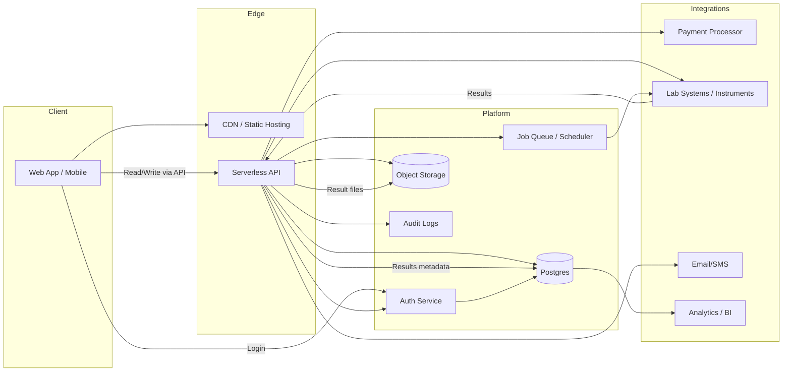

# Lab Platform Architecture

This folder contains architecture notes and diagrams.

## Files
- lab-platform-architecture.mmd: Mermaid flowchart describing the platform components and their data flows.
- current-website-architecture.md: Current-state architecture for the GitHub Pages + Firebase website.

## Overview
- Current website: static GitHub Pages frontend, Firebase Authentication, Firestore for private user data, Stripe for payment UI, and GoDaddy-managed DNS.
- Client: web or mobile UI used by patients and admins.
- Edge: CDN for static hosting and a serverless API for secure operations.
- Platform: auth, Postgres, object storage, job scheduling, and audit logs.
- Integrations: payments, lab systems, notifications, and analytics.

## Rendering
If your tooling supports Mermaid, render the `.mmd` file directly, or embed it in Markdown like this:

