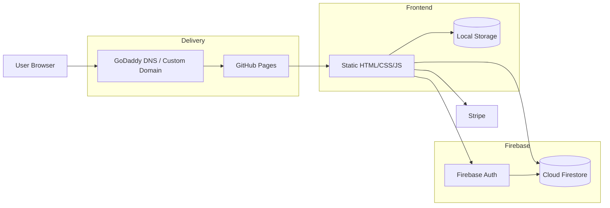

# Current Website Architecture

This document shows the current basic architecture of the Ayuta demo website after the login and registration changes.

## Summary

- Public site hosting: GitHub Pages
- Custom domain: GoDaddy-managed DNS pointing to GitHub Pages
- Frontend: static HTML, CSS, and JavaScript
- Authentication: Firebase Authentication
- Private user data: Cloud Firestore
- Payments: Stripe frontend flow
- Browser-only temporary state: local storage for basket and demo fallback data

## High-Level Diagram



## What Lives Where

### Public

- Landing page
- About page
- Contact page
- Static assets and frontend code

These are delivered from GitHub Pages and are public by design.

### Protected By Login

- Profile page
- Orders page
- Results page

These pages are still served as static HTML, but the private content is only loaded after Firebase confirms the user identity.

## Request and Data Flow

1. A visitor opens the site through the custom domain.
2. GoDaddy DNS points the domain to GitHub Pages.
3. GitHub Pages serves the static frontend.
4. The frontend opens login and registration flows through Firebase Authentication.
5. After sign-in, the frontend reads and writes the signed-in user's profile, orders, and results in Firestore.
6. The orders and results pages only show account data that belongs to the authenticated Firebase user.
7. Local storage still keeps non-sensitive browser state such as basket progress and local fallback demo data.

## Firestore Structure

```text
users/{uid}
users/{uid}/orders/{orderId}
users/{uid}/results/{orderId}
```

## Important Constraints

- GitHub Pages cannot truly secure files placed directly in the website output.
- Sensitive user data must stay in Firestore behind security rules, not in static JSON or HTML files.
- The current Stripe flow is still frontend/demo-oriented. Real payment confirmation should eventually move behind a backend or serverless function.

## Current Responsibility Split

- GitHub Pages: static hosting only
- GoDaddy: domain and DNS only
- Firebase Auth: registration, sign-in, password reset, session state
- Firestore: per-user private records
- Frontend JS: page gating, rendering, and client-side state
